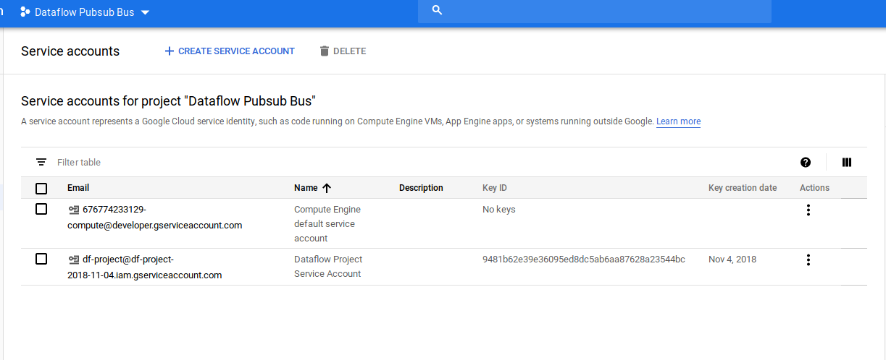
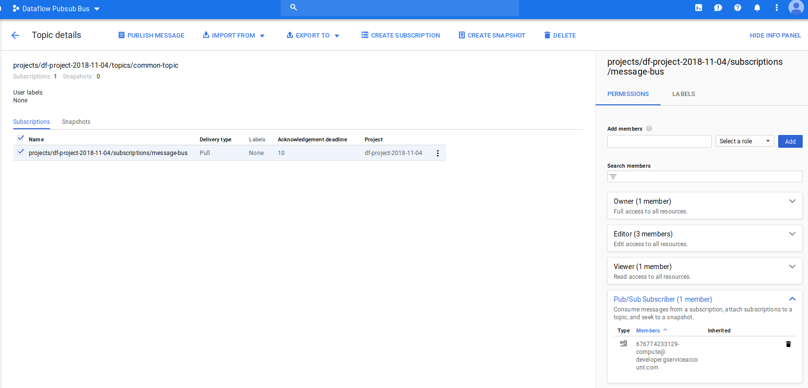
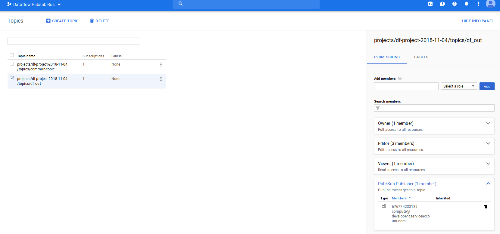
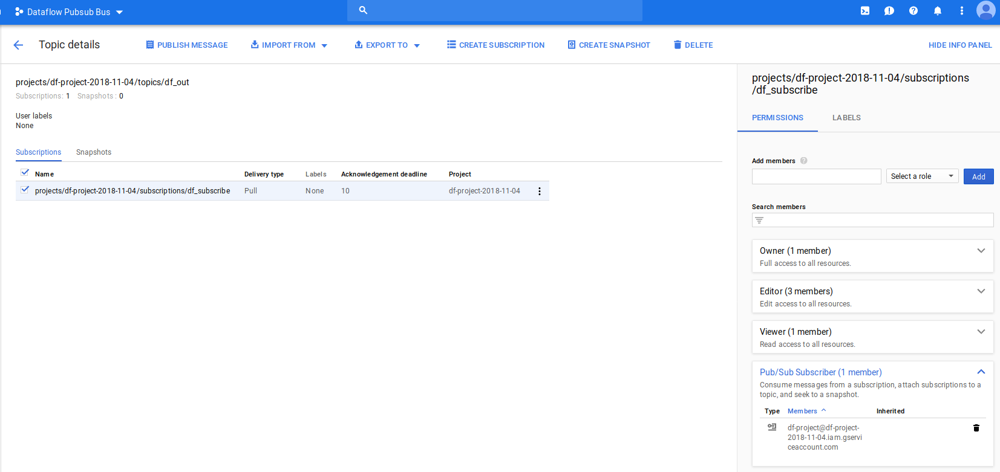
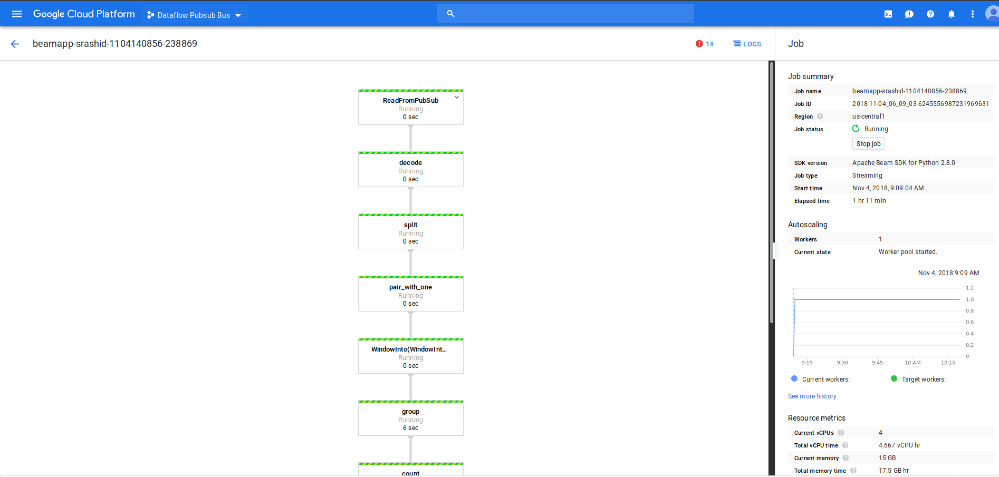
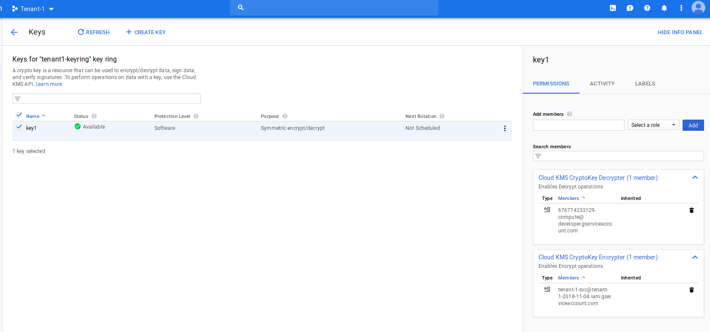
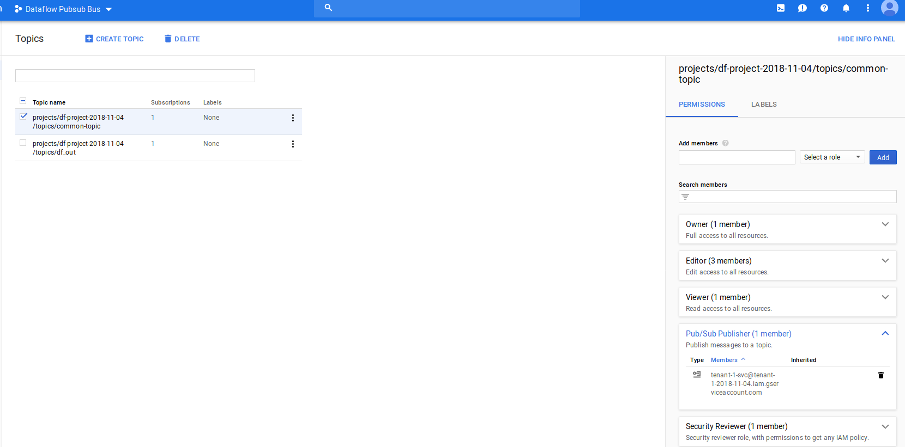

# Message Encryption with Dataflow PubSub Stream Processing

Dataflow Streaming pipeline where each pubsub messages payload data is encrypted or digitally singed.

This technique can be used where a common "message bus" shared PubSub topic is used by N message producers and where
the consumer needs to either verify the integrity of the message that was submitted or unwrap the contents of the message
given an encryption key owned by the producer.

In other words,

- ProjectA runs the Dataflow Pipeline DF1 and owns a PubSub Topic T1
- ProjectB owns a service account with permissions to submit messages to Topic T1
- ProjectB owns KMS key K1 and uses it to _encrypt_ a message.
- ProjectA has permissions on ProjectB's KMS K1 to _decrypt_
- ProjectB can now wrap a PubSub message with K1 and place it in T1
- ProjectA Dataflow Pipline will read each message and use K1 to decrypt it in the pipeline

In this why, the common shared topic can contain messages from a variety of sources where each message producer retains the
ownership of the KMS key used to decrypt the message.   Users can extend the pattern above for any number of message producers with
their own KMS Keys.  (eg. 10 different producers all sumbit messages to the shared topic).

This techinque is rather convoluted use of dataflow and pubsub in that normally you would setup different DF pipelines or Topics.

This sample extends the 4th technique detailed here:

- [Message Payload Encryption in Google Cloud Pub/Sub](https://github.com/salrashid123/gcp_pubsub_message_encryption)


The specific code sample here is the basic DataFlow WordCount.  A single producer emits encypted messages to a common pubsub topic.

Each message is decrypted by Dataflow worker and a count of words per window is displayed by a subscriber pubsub topic.


that is

- ProjectA runs Streaming pipeline that reads from Topic T1, decrypts a message then writes the message to Topic T2
- ProjectB uses KMS to encrypt a message and places it on Topic T1
- PubsubSubscriber reads messages emitted on T1 and displays the WordCount

There are several optimizations applied to the dataflow and pubsub message decryption:  instead of using `KMS` to encrypt and 
decrypt _each_ pubsub message, an expiring AES Symmetric key is generated at the message producer side and that is what
gets encrypted by a `KMS` key.  The encrypted key is only valid for say 100seconds and is placed within the attributes of the pubsubmessage
itself.  This is basically `envelope encryption`.  

One problem with PubSub and envelope encryption is that the message data in the attribute set is lost unless the payload has the message
and originally intended attribute set as well


## Setup

The setup steps creates two projects, several pubsub topics and KMS keys.  While you can run this whole sample in one GCP project,
I've setup two to demonstrate tenancy and separation of access.

To run these commands, you need to either be a project owner or have the ability to create GCP projects


### Command Reference

*  `publisher.py`  Publish a signed or encrypted message to the common message bus topic.
   - `--mode`: either `encrypt` or `sign`
   - `--service_account`: path to the service account json file to encrypt/sign and place on the common pubsub topic.
   - `--pubsub_project_id`: projectID for the shared pubsub topic
   - `--pubsub_topic`: shared topic name
   - `--kms_project_id`: projectID that hosts the KMS keyring and keyid for encryption/sign
   - `--kms_location`: location of the keyring
   - `--kms_key_ring_id`: KMS key ring name
   - `--kms_key_id`: the key to use for encryption/sign

*  `pubsub_bus.py`  Dataflow Pipeline Runner that reads the common pubsub topic, decrypts messages and outputs those to another topic.
   - `--mode`: either `decrypt` or `verify`
   - `--output_topic`: topic to write pubsub messages after wordcount DF pipeline
   - `--input_subscription`: Subscription to read messages from te shared topic
   - `--setup_file`:  path to setup.py to enable local modules. Set it to `pwd/setup.py` as shown below
   - `--extra_package`: extra packages.  Set it to (`pwd/gcp_encryption/dist/gcp_encryption-0.0.1.tar.gz`)
   - `--project`: projectID for the dataflow pipeline
   - `--temp_location`: GCS bucket for DF
   - `--staging_location`: staging GCS bucket for DF

*  `df_subscriber.py`  Pubsub message subscriber that reads the *output* messages from the DF pipeline
   - `--service_account`: Service Account that has access to read an output subscription _from_ DF
   - `--pubsub_project_id`: projectID for the pubsub topic that DF writes _to_
   - `--pubsub_subscription`: Subscription to read messages from te output topic

*  `subscriber.py`  Pubsub message subscriber that **directly** reads from a shared pubsub topic (similar to Dataflow Pipeline); (optional) this is used for debugging only.  TO use this script. the `service_account` must have a subscription to the common message bus _and_ have access to the KMS keys that was used to encrypt the payload.
   - `--mode`: either `decrypt` or `verify`
   - `--service_account`: path to the service account json file to encrypt/sign and place on the common pubsub topic.
   - `--pubsub_project_id`: projectID for the shared pubsub topic
   - `--pubsub_subscription`:  Subscription to read messages from te shared topic

### Setup Environment variables

Since we will create several projects, in one shell, setup some variables
```

export NONCE=$(date '+%Y-%m-%d')-$USER
export df_PROJECT=df-project-$NONCE
export REGION=us-central1
export tenant_1=tenant-1-$NONCE
export tenant_2=tenant-2-$NONCE
```

### Create DataFlow Project

Now create a project that will host the dataflow and pubsub common topic.

Remember to associate a billing account with this project.

```
gcloud projects create $df_PROJECT --name "Dataflow Pubsub Bus" --enable-cloud-apis 
gcloud services enable dataflow.googleapis.com cloudkms.googleapis.com --project $df_PROJECT
gcloud config set project df-project-$NONCE

gcloud auth application-default login
```

- Create a service account that will subscribe to events emitted by the DF pipeline

```
cd dataflow_src/
mkdir certs
gcloud iam service-accounts create df-project --display-name="Dataflow Project Service Account" --project $df_PROJECT
gcloud iam service-accounts keys  create certs/svc-provider.json --iam-account=df-project@$df_PROJECT.iam.gserviceaccount.com --project $df_PROJECT
```

You should see two service accounts if its a newly created project:
    ```
    $ gcloud iam service-accounts list --project $df_PROJECT
    NAME                                    EMAIL
    Dataflow Project Service Account        df-project@df-project-2018-11-04.iam.gserviceaccount.com
    Compute Engine default service account  676774233129-compute@developer.gserviceaccount.com
    ```


- Create the pubsub Topic and allow DF to subscribe:

```
gcloud pubsub topics create common-topic --project $df_PROJECT
gcloud pubsub subscriptions create message-bus --topic=common-topic --project $df_PROJECT 
```




- Use Google Cloud console or gcloud  to set IAM permission on the DF Project service account to subscribe

```bash
export df_PROJECT_NUMBER=`gcloud projects describe  $df_PROJECT --format="value(projectNumber)"`
export df_COMPUTE_SVC_ACCOUNT=$df_PROJECT_NUMBER-compute@developer.gserviceaccount.com

echo "{
  \"bindings\": [
    {
      \"role\": \"roles/pubsub.subscriber\",
      \"members\": [
        \"serviceAccount:$df_COMPUTE_SVC_ACCOUNT\",
      ]
    }
  ],
}" >policy.txt

gcloud  --project  $df_PROJECT pubsub subscriptions set-iam-policy message-bus policy.txt
rm policy.txt
```

  


- Create a temp GCS bucket for use by DataFlow:

```
$ gsutil mb gs://$df_PROJECT-dftemp
```

- Add IAM permissions for you to setup the DF pipeline:

```
gsutil iam ch user:$(gcloud config get-value core/account):objectCreator,objectViewer gs://$df_PROJECT-dftemp
```

- Create output topic/subscriptions for DF

```
gcloud pubsub topics create df_out --project $df_PROJECT 
gcloud pubsub subscriptions create df_subscribe --topic=df_out --project $df_PROJECT
```

- Use cloud console to add IAM permissions to the topic and subscription

1)  goto  topic 'df_out'  add the  "Compute Engine default service account" as a pubslisher

```bash
echo "{
  \"bindings\": [
    {
      \"role\": \"roles/pubsub.publisher\",
      \"members\": [
        \"serviceAccount:$df_COMPUTE_SVC_ACCOUNT\",
      ]
    }
  ],
}" >policy.txt

gcloud  --project  $df_PROJECT pubsub topics set-iam-policy df_out policy.txt
rm policy.txt
```

 

2) goto subscription for 'df_out' --> 'df_subscribe' add the  "Dataflow Project Service Account " as a subscirber

```bash
echo "{
  \"bindings\": [
    {
      \"role\": \"roles/pubsub.subscriber\",
      \"members\": [
        \"serviceAccount:df-project@$df_PROJECT.iam.gserviceaccount.com\",
      ]
    }
  ],
}" >policy.txt

gcloud  --project  $df_PROJECT pubsub subscriptions set-iam-policy df_subscribe policy.txt
rm policy.txt
```

 

### Run DF pipeline:

Now that we've setup the first part, lets see if we can run the dataflow pipeline as is:

- Setup a virtualenv and package the custom libraries:

```bash
gcloud auth application-default login
virtualenv env --python=/usr/bin/python3.7
source env/bin/activate
cd gcp_encryption/
python setup.py sdist
cd ../

pip install apache-beam[gcp] google-cloud-kms lorem cryptography expiringdict tink
```

- Now run the pipeline with `DataFlowRunner`  (you can also just use `DirectRunner` for local testing if your user credentials
has access to the topics and subscriptions defined above)

```bash
python pubsub_bus.py \
    --mode=decrypt \
    --region=$REGION \
    --runner DirectRunner \
    --setup_file `pwd`/setup.py  \
    --extra_package=`pwd`/gcp_encryption/dist/gcp_encryption-0.0.1.tar.gz  \
    --max_num_workers=1 \
    --project $df_PROJECT \
    --temp_location gs://$df_PROJECT-dftemp/temp \
    --staging_location gs://$df_PROJECT-dftemp/stage  \
    --output_topic projects/$df_PROJECT/topics/df_out  \
    --input_subscription projects/$df_PROJECT/subscriptions/message-bus
```

  


### Create subscriber for DF pipeline Output

In a new window, reset the environment variables
```bash
source env/bin/activate
export NONCE=$(date '+%Y-%m-%d')-$USER
export df_PROJECT=df-project-$NONCE
export tenant_1=tenant-1-$NONCE
export tenant_2=tenant-2-$NONCE
```

Now run the subscriber

```bash
python df_subscriber.py --service_account certs/svc-provider.json \
  --pubsub_project_id $df_PROJECT \
  --pubsub_subscription df_subscribe
```


At the end of this step, you should have a pubsub pipeline running and a subscriber listening for the output of the pipeline.


### Create Message Producer Project and KMS permissions

The following step will setup a pubsub message producer to send encrypted messages into the common, shared topic

In a new window, reset the environment variables
```bash
source env/bin/activate
export NONCE=$(date '+%Y-%m-%d')-$USER
export df_PROJECT=df-project-$NONCE
export tenant_1=tenant-1-$NONCE
export tenant_2=tenant-2-$NONCE
```

- Create the tenant/producer project

```bash
gcloud projects create $tenant_1 --name "Tenant-1" --enable-cloud-apis 
gcloud services enable cloudkms.googleapis.com pubsub.googleapis.com --project $tenant_1
```

Associate a billing account with `$tenant_1`

- Create a service account on that project

```
gcloud iam service-accounts create tenant-1-svc --display-name="Tenant-1 Service Account" --project $tenant_1
gcloud iam service-accounts keys  create certs/svc-tenant-1.json --iam-account=tenant-1-svc@$tenant_1.iam.gserviceaccount.com --project $tenant_1
```

- Create a KMS keyring and Key
```
gcloud kms keyrings create tenant1-keyring  --location $REGION --project $tenant_1
gcloud kms keys create key1 --location=$REGION --purpose=encryption --keyring=tenant1-keyring --project $tenant_1
```

Your tenant project should now show a single service account
```
  $ gcloud iam service-accounts list --project $tenant_1
  NAME                      EMAIL
  Tenant-1 Service Account  tenant-1-svc@tenant-1-2018-11-04.iam.gserviceaccount.com
```

- Set KMS permissions on the key

The following commands will be different for you:

First set an IAM policy on the key such that the Service Account that runs Dataflow can use that key to Decrypt:

Note, your service account will be different

```bash
# first make sure you have this set in env
echo $df_COMPUTE_SVC_ACCOUNT

gcloud kms keys add-iam-policy-binding key1 \
      --keyring tenant1-keyring \
      --location $REGION \
      --member=serviceAccount:$df_COMPUTE_SVC_ACCOUNT \
      --role='roles/cloudkms.cryptoKeyDecrypter' --project $tenant_1
```

Second, set KMS permissions so the service account that places a message on the common topic has the rights to use
that key to encrypt:

Note, your service account will be different
```bash
gcloud kms keys add-iam-policy-binding key1 \
      --keyring tenant1-keyring \
      --location $REGION \
      --member=serviceAccount:tenant-1-svc@$tenant_1.iam.gserviceaccount.com \
      --role='roles/cloudkms.cryptoKeyEncrypter' --project $tenant_1
```

  

### Add tenant to DF Pubsub Topic

Switch to the main Dataflow Pipeline project

Use Cloud console to add the tenant/producers's service account rights to place messages on the shared Topic:


```bash
echo "{
  \"bindings\": [
    {
      \"role\": \"roles/pubsub.publisher\",
      \"members\": [
        \"serviceAccount:tenant-1-svc@$tenant_1.iam.gserviceaccount.com\",
      ]
    }
  ],
}" >policy.txt

gcloud  --project  $df_PROJECT pubsub topics set-iam-policy common-topic policy.txt
rm policy.txt
```

```
add tenant-1-svc@tenant-1-2018-11-04.iam.gserviceaccount.com  to topic 
           projects/df-project-2018-11-04/topics/common-topic
    as publisher
```

  

### RUN Publisher for tenant1

Now try to run the publisher script:

```bash

```

What that will do is create an AES key, wrap it with KMS, then place the message on the shared topcic:


```
python publisher.py  --mode encrypt --service_account 'certs/svc-tenant-1.json' --pubsub_project_id $df_PROJECT \
   --pubsub_topic common-topic --kms_project_id $tenant_1  \
   --kms_location us-central1 --kms_key_ring_id tenant1-keyring --kms_key_id key1
2018-11-04 09:56:43,242 - root - INFO - >>>>>>>>>>> Start Encryption with locally generated key.  <<<<<<<<<<<
2018-11-04 09:56:43,242 - root - INFO - Rotating symmetric key
2018-11-04 09:56:43,242 - root - INFO - Starting KMS encryption API call
2018-11-04 09:56:43,261 - googleapiclient.discovery - INFO - URL being requested: POST https://cloudkms.googleapis.com/v1/projects/tenant-1-2018-11-04/locations/us-central1/keyRings/tenant1-keyring/cryptoKeys/key1:encrypt?alt=json
2018-11-04 09:56:43,803 - root - INFO - End KMS encryption API call
2018-11-04 09:56:43,812 - root - INFO - Start PubSub Publish
2018-11-04 09:56:43,821 - root - INFO - Published Message: izqIBBc0sKIPi3a2rhwin+grNWYr46rAjbsxduS12nQfaBI8E7112/WSCjw8+daJe+33XFQ5YHHtX/+mYL+UojhAYQxHK31On44eGTpyia0awS1zDF6PB5geju9wVQD4S7HwpAhENTS8ivGwiFAgeDuDQZm3PQQliNv/p5m9bWPeKfmbE8oFou8L1juZqncQxNdtuB+i7J/h/GuYfUFVVh43LANzGiXq9UkbdaBnGto+IX4oxt7NbsyACEOcWcXTI40peQ2DXIl8LoPij1/xtHuBRu2qiRsSN+wzwmfDqX7ox16OAKBxphjT94B2zWhe+FXK7fPxe9HW9mEKpY4Ltz+5QtgHBs/fZfNSvc99Tqo=
```

---

The dataflow pipline should be still running from the previous step:

The DF pipeline here will be reading in a message, decrypting it and placing the wordcounts on another output topic

```
$ python pubsub_bus.py --runner DataFlowRunner --setup_file `pwd`/setup.py   --requirements_file requirements.txt --extra_package=`pwd`/gcp_encryption/dist/gcp_encryption-0.0.1.tar.gz  --max_num_workers=1 --project $df_PROJECT --temp_location gs://$df_PROJECT-dftemp/temp --staging_location gs://$df_PROJECT-dftemp/stage  --output_topic projects/$df_PROJECT/topics/df_out  --input_subscription projects/$df_PROJECT/subscriptions/message-bus --region $REGION --mode decrypt

Starting
...
gs://df-project-2018-11-04-dftemp/stage/beamapp-srashid-1104140856-238869.1541340536.238981/apache_beam-2.8.0-cp27-cp27mu-manylinux1_x86_64.whl
INFO:root:Create job: <Job
 createTime: u'2018-11-04T14:09:04.660304Z'
 currentStateTime: u'1970-01-01T00:00:00Z'
 id: u'2018-11-04_06_09_03-6245556987231969631'
 location: u'us-central1'
 name: u'beamapp-srashid-1104140856-238869'
 projectId: u'df-project-2018-11-04'
 stageStates: []
 steps: []
 tempFiles: []
 type: TypeValueValuesEnum(JOB_TYPE_STREAMING, 2)>
INFO:root:Created job with id: [2018-11-04_06_09_03-6245556987231969631]
INFO:root:To access the Dataflow monitoring console, please navigate to https://console.cloud.google.com/dataflow/jobsDetail/locations/us-central1/jobs/2018-11-04_06_09_03-6245556987231969631?project=df-project-2018-11-04
INFO:root:Job 2018-11-04_06_09_03-6245556987231969631 is in state JOB_STATE_PENDING
INFO:root:2018-11-04T14:09:06.635Z: JOB_MESSAGE_DETAILED: Checking permissions granted to controller Service Account.
INFO:root:2018-11-04T14:09:07.440Z: JOB_MESSAGE_BASIC: Worker configuration: n1-standard-4 in us-central1-a.
INFO:root:2018-11-04T14:09:07.761Z: JOB_MESSAGE_DETAILED: Expanding CollectionToSingleton operations into optimizable parts.
INFO:root:2018-11-04T14:09:07.767Z: JOB_MESSAGE_DETAILED: Expanding CoGroupByKey operations into optimizable parts.
INFO:root:2018-11-04T14:09:07.774Z: JOB_MESSAGE_DETAILED: Expanding SplittableProcessKeyed operations into optimizable parts.
INFO:root:2018-11-04T14:09:07.776Z: JOB_MESSAGE_DETAILED: Expanding GroupByKey operations into streaming Read/Write steps
INFO:root:2018-11-04T14:09:07.780Z: JOB_MESSAGE_DEBUG: Annotating graph with Autotuner information.
INFO:root:2018-11-04T14:09:07.792Z: JOB_MESSAGE_DETAILED: Fusing adjacent ParDo, Read, Write, and Flatten operations
INFO:root:2018-11-04T14:09:07.794Z: JOB_MESSAGE_DETAILED: Fusing consumer ReadFromPubSub/Map(_from_proto_str) into ReadFromPubSub/Read
INFO:root:2018-11-04T14:09:07.796Z: JOB_MESSAGE_DETAILED: Fusing consumer split into decode
INFO:root:2018-11-04T14:09:07.798Z: JOB_MESSAGE_DETAILED: Fusing consumer group/MergeBuckets into group/ReadStream
INFO:root:2018-11-04T14:09:07.801Z: JOB_MESSAGE_DETAILED: Fusing consumer WriteToPubSub/Write/NativeWrite into encode
INFO:root:2018-11-04T14:09:07.803Z: JOB_MESSAGE_DETAILED: Fusing consumer encode into format
INFO:root:2018-11-04T14:09:07.805Z: JOB_MESSAGE_DETAILED: Fusing consumer format into count
INFO:root:2018-11-04T14:09:07.807Z: JOB_MESSAGE_DETAILED: Fusing consumer group/WriteStream into WindowInto(WindowIntoFn)
INFO:root:2018-11-04T14:09:07.808Z: JOB_MESSAGE_DETAILED: Fusing consumer count into group/MergeBuckets
INFO:root:2018-11-04T14:09:07.810Z: JOB_MESSAGE_DETAILED: Fusing consumer WindowInto(WindowIntoFn) into pair_with_one
INFO:root:2018-11-04T14:09:07.812Z: JOB_MESSAGE_DETAILED: Fusing consumer decode into ReadFromPubSub/Map(_from_proto_str)
INFO:root:2018-11-04T14:09:07.814Z: JOB_MESSAGE_DETAILED: Fusing consumer pair_with_one into split
INFO:root:2018-11-04T14:09:07.818Z: JOB_MESSAGE_DEBUG: Adding StepResource setup and teardown to workflow graph.
INFO:root:2018-11-04T14:09:07.841Z: JOB_MESSAGE_DEBUG: Adding workflow start and stop steps.
INFO:root:2018-11-04T14:09:07.892Z: JOB_MESSAGE_DEBUG: Assigning stage ids.
INFO:root:2018-11-04T14:09:08.051Z: JOB_MESSAGE_DEBUG: Executing wait step start2
INFO:root:2018-11-04T14:09:08.062Z: JOB_MESSAGE_DEBUG: Starting worker pool setup.
INFO:root:2018-11-04T14:09:08.066Z: JOB_MESSAGE_BASIC: Starting 1 workers...
INFO:root:Job 2018-11-04_06_09_03-6245556987231969631 is in state JOB_STATE_RUNNING
INFO:root:2018-11-04T14:09:10.927Z: JOB_MESSAGE_BASIC: Executing operation ReadFromPubSub/Read+ReadFromPubSub/Map(_from_proto_str)+decode+split+pair_with_one+WindowInto(WindowIntoFn)+group/WriteStream
INFO:root:2018-11-04T14:09:10.927Z: JOB_MESSAGE_BASIC: Executing operation group/ReadStream+group/MergeBuckets+count+format+encode+WriteToPubSub/Write/NativeWrite
INFO:root:2018-11-04T14:09:52.021Z: JOB_MESSAGE_DETAILED: Workers have started successfully.
INFO:root:2018-11-04T14:09:57.246Z: JOB_MESSAGE_DEBUG: Executing input step topology_init_attach_disk_input_step
```

The pubsub subscriber listening to the output of the Dataflow pipeline will show the decrypted lorem ipsum messages and word counts:


```
$ python df_subscriber.py --service_account 'certs/svc-provider.json' --pubsub_project_id $df_PROJECT --pubsub_subscription df_subscribe
2018-11-04 10:18:27,122 INFO >>>>>>>>>>> Start <<<<<<<<<<<
2018-11-04 10:18:27,365 INFO Listening for messages on projects/df-project-2018-11-04/subscriptions/df_subscribe
2018-11-04 10:18:51,289 INFO magnam: 7
2018-11-04 10:18:51,371 INFO quiquia: 7
2018-11-04 10:18:51,374 INFO velit: 8
2018-11-04 10:18:51,374 INFO etincidunt: 5
2018-11-04 10:18:51,376 INFO Dolore: 1
2018-11-04 10:18:51,378 INFO tempora: 9
2018-11-04 10:18:51,451 INFO Magnam: 2
2018-11-04 10:18:51,574 INFO consectetur: 4
2018-11-04 10:18:51,577 INFO amet: 5
2018-11-04 10:18:51,580 INFO adipisci: 3
2018-11-04 10:18:51,582 INFO porro: 9
2018-11-04 10:18:51,583 INFO Etincidunt: 2
2018-11-04 10:18:51,584 INFO Modi: 1
2018-11-04 10:18:51,585 INFO dolor: 1
2018-11-04 10:18:51,586 INFO quaerat: 3
2018-11-04 10:18:51,588 INFO modi: 5
2018-11-04 10:18:51,589 INFO Quiquia: 2
2018-11-04 10:18:51,590 INFO Non: 1
2018-11-04 10:18:51,591 INFO Velit: 1
2018-11-04 10:18:51,592 INFO neque: 7
2018-11-04 10:18:51,593 INFO Eius: 4
2018-11-04 10:18:51,594 INFO Adipisci: 1
2018-11-04 10:18:51,595 INFO labore: 12
2018-11-04 10:18:51,596 INFO numquam: 4
2018-11-04 10:18:51,598 INFO Dolorem: 1
2018-11-04 10:18:51,599 INFO Aliquam: 2
2018-11-04 10:18:51,677 INFO Ipsum: 1
2018-11-04 10:18:51,679 INFO quisquam: 6
2018-11-04 10:18:51,680 INFO ipsum: 5
2018-11-04 10:18:51,681 INFO ut: 9
2018-11-04 10:18:51,683 INFO Neque: 2
2018-11-04 10:18:51,684 INFO Ut: 2
2018-11-04 10:18:51,685 INFO sit: 9
2018-11-04 10:18:51,687 INFO Sed: 2
2018-11-04 10:18:51,688 INFO voluptatem: 6
2018-11-04 10:18:51,689 INFO Quisquam: 2
2018-11-04 10:18:51,689 INFO Labore: 1
2018-11-04 10:18:51,690 INFO aliquam: 2
2018-11-04 10:18:51,692 INFO sed: 5
2018-11-04 10:18:51,693 INFO Voluptatem: 1
2018-11-04 10:18:51,694 INFO Dolor: 3
2018-11-04 10:18:51,695 INFO Est: 2
2018-11-04 10:18:51,696 INFO eius: 5
2018-11-04 10:18:51,833 INFO non: 7
2018-11-04 10:18:51,834 INFO est: 7
2018-11-04 10:18:51,837 INFO Numquam: 1
2018-11-04 10:18:51,837 INFO dolore: 2
2018-11-04 10:18:51,839 INFO dolorem: 8
```

## Verify message integrity (sign/verify)

Each message producer can also just submit the message without encryption with an wrapped `HMAC` integrity signature.

The DataFlow pipeline will read the unencrypted message as well as the encrypted HMAC singature and then use KMS to 
decrypt the signature key.  With the paintext HMAC key, the pipeline can verify the message integrity.

To use this, simply alter `publisher.py` and pass in ```--mode=sign```.

On the DF Pipeline side, set the `--mode` argument to `verify`


## Non-Repudiation
The HMAC based signing and AES encryption provides only integrity and confidentiality…they do not provide non-repudiation (i.e. assertion that the message originator is authentic. You will need access to a Public-Private keypair to verify and sign the pubsub message similar to the integrity check above.

There are two ways to achieve this:

1. Use Cloud KMS APIs to sign each message and provide metadata attribute link to the KMS key that signed it.
*  https://cloud.google.com/kms/docs/create-validate-signatures then on the Dataflow side, use a cached copy of the public key reference to verify https://cloud.google.com/kms/docs/retrieve-public-key

2. Use a service_account’s public/private key reference to achieve a similar result to above:

*  Use the private key for a given service_account to sign a message. Attach metadata reference to the URL of the public portion of that service key as a message attachement. On the DataFlow side, download the public key and use that to verify the signature. This technique is described here for purely pubsub: [salrashid123/gcp_pubsub_message_encryption](https://github.com/salrashid123/gcp_pubsub_message_encryption/tree/master/2_svc)


## Ephemeral session encryption keys

The AES encryption and HMAC keys are wrapped with KMS but to avoid repeated roundtrips, these keys are held in cache at _both_
the client and at Dataflow workier.  Each key can expire at different intervals:  if the DF worker does not recognize a session
key in cache, it makes a KMS api call to decrypt it.  THe DF service then saves both the wrapped key and decrypted version of it
in an expiring dictionary:

```
from expiringdict import ExpiringDict
self.cache = ExpiringDict(max_len=100, max_age_seconds=200)
```
### PubSub Message modification

*WARNING*: 

Inorder to embed encrypted or signed payload, the specific technique used here involves modification of the normal PubSub.

THat is, normally a pubsub message contains several user-defined and automatic fields:

- [pubsub.proto](https://github.com/googleapis/googleapis/blob/master/google/pubsub/v1/pubsub.proto#L340)
```text
message PubsubMessage {
  // The message data field. If this field is empty, the message must contain
  // at least one attribute.
  bytes data = 1;

  // Optional attributes for this message.
  map<string, string> attributes = 2;

  // ID of this message, assigned by the server when the message is published.
  // Guaranteed to be unique within the topic. This value may be read by a
  // subscriber that receives a `PubsubMessage` via a `Pull` call or a push
  // delivery. It must not be populated by the publisher in a `Publish` call.
  string message_id = 3;

  // The time at which the message was published, populated by the server when
  // it receives the `Publish` call. It must not be populated by the
  // publisher in a `Publish` call.
  google.protobuf.Timestamp publish_time = 4;
}
```

This technique alters the message in fundamental ways.  

- For encryption, the actual pubsub message is in the format:

```python
publisher.publish(topic_name, data=encrypted_message.encode('utf-8'), kms_key=name, dek_wrapped=dek_encrypted)
```

or 
```json
  data:  encrypted text of the original message
  kms_keyname: fully qualified path to the kms key that encrypted this message
  dek_wrapped: wrapped AES encryption key for this specific message
```

- For sign, the actual pubsub message is in the format:

```python
publisher.publish(topic_name, data=json.dumps(cleartext_message), kms_key=name, sign_key_wrapped=sign_key_wrapped, signature=msg_hash)
``` 

or 
```json
  data:  plaintext of the original message
  kms_key: fully qualified path to the kms key that encrypted this message
  sign_key_wrapped: wrapped HMAC signing key for this specific message
  signature: signature of the original message
```

Note, in both cases, the PubSUb attributes are overrided.  Inorder to embed attributes, they will need to get placed as JSON within a message
eg.

```text
    cleartext_message = {
            "data" : "foo bar".encode(),
            "attributes" : {
                "epoch_time":  int(time.time()),
                "a": "aaa",
                "c": "ccc",
                "b": "bbb"
            }
    }
```


## Conclusion

THis is just a POC i wrote up with just a bit of practical use:  Sure you can encrypt a message and place
and encrypted message into pubsub, but to achieve tenancy, it'd be eaiser ot just setup different topics  per tenant
alltogether.

However, if you do need a shared pubsub topic and you need to ensure message secrecy or integrity per producer, you can
explore variations of this technique.